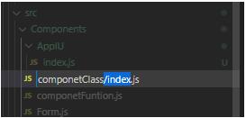

# ¿Como trabajar en React.js?
Para iniciar un proyecto nuevo en React.js es necesario primero instalar Node.js en el ordenador.
Una vez instalada creamos un espacio de trabajo donde guardaremos nuestro proyecto y con la terminal de comando que apunta a la carpeta donde estará nuestro proyecto copiaremos la siguiente línea de comando

	npx create-react-app nombre-del-proyecto

## Componentes y Elementos
En versiones más antiguas de React.js era muy común utilizar componentes para crear componentes independientes que puedan ser reutilizados.
React te permitía definir ya sea como una función o como una clase.

	import React, { Component } from "react";

	class TitleOne extends Component {
		render() {
			return <h1>Hola mundo</h1>;
		}
	}

	export default TitleOne;

archivo receptor

	import React from "react";

	const TitleTwo = () => {
		return <h1>Hola Mundo</h1>;
	};

	export default TitleTwo;

Cada componente tiene que ser importado y luego llamado en el archivo App.js; React por defecto solo te permite renderizar un elemento por lo que si queremos renderizar dos elementos hijos tendremos que hacerlo dentro de un contenedor padre.

	import './App.css';
	import TitleOne from './Components/componetClass';
	import TitleTwo from './Components/componetFuntion';

	function App() {

	  return (
		

		  <TitleOne />
		  <TitleTwo />
		

	  );
	}

Cada componente a su vez va a estar conteniendo a varios elementos, que en estos ejemplos son nuestros H1. Cabe aclarar que etiquetas Html y los elementos no son los mismo, ya que detrás de escena React va traduciendo a código js los elementos.
Cuando le damos estilos a nuestras páginas, solemos con mucha frecuencia usar el atribulo “Class” en React cambiamos esta palabra por ClaseName que funciona igual.
Para ellos vamos a ir a nuestra carpeta public y entrar en el archivo index.html copiaremos los links dejados en la documentación de Bootstrap.

	<link href="https://cdn.jsdelivr.net/npm/bootstrap@5.0.2/dist/css/bootstrap.min.css" rel="stylesheet" integrity="sha384-EVSTQN3/azprG1Anm3QDgpJLIm9Nao0Yz1ztcQTwFspd3yD65VohhpuuCOmLASjC" crossorigin="anonymous">
	

Y luego en cualquiera de nuestras etiquetas agregaremos un className para comprobar si obtenemos el mismo efecto.
Ahora supongamos que queremos pasar valores a nuestros componentes, por ejemplo, un nombre. Es tan fácil como agregar una propiedad

	function App() {
	  return (
		

		  <TitleOne />
		  <TitleTwo Nombre="Pedro" />
		

	  );
	}

	const TitleTwo = (props) => {

		return <h1> Hola {props.Nombre}</h1>;
	};

Ahora, como ya es muy sabido que el excesivo uso de la etiqueta div es una mala práctica siempre podemos cambiar el “div” que encapsula lo que queremos renderizar por un Fragment

	function App() {
	  return (
		<Fragment>
		  <TitleOne />
		  <TitleTwo Nombre="Pedro" />
		</Fragment>
	  );
	}

Con estas simples explicaciones ya sabemos cómo renderizar vistas, enviar parámetros y dar estilos a nuestras vistas. Ahora es momento de saber cómo crear eventos con React.js.
Para ello vamos a ir a nuestro archivo TitleTwo.js y agregaremos el evento OnClick.
Nota: los eventos en React tienen el mismo nombre que en Js, solo que se le antepone la palabra “On”.
Suponiendo que nosotros queremos pasar información a la función que está a la escucha del evento, eso es tan simple como llamar una arrow funtion.

	const TitleTwo = (props) => {
		const ClickMe = (msg) => {
			alert("¡Me tocaste! " + msg)
		}

		return <h1
			onClick={() => ClickMe("¡Pervertido!")}
		> Hola {props.Nombre}</h1>;
	};

Otro tipo de dato importante a la hora de programar en React.js son los estados. Estos son un almacén de datos mutables y autónomos. Este tiene en común con las propiedades que son atributos de clases, pero tiene propósitos diferentes “mientras las propiedades son inmutables, los valores de los estados pueden cambiar”
En versiones anteriores era muy común llamar a estos estados en el constructor.

	import React, { Component } from "react";

	class TitleOne extends Component {
    constructor(props) {
        super(props)
        this.state = {
            name: 'juan'
        };
    }

    render() {
        return <h1 className="text-primary">Hola {this.state.name}</h1>;
    }
	}

	export default TitleOne;

> Nota: como este es una clase que hereda de otra, el objeto tiene que tener la clase super(props) y se le tiene que pasar el props como parámetro o si no arrancara.
En versiones mas recientes podemos hacer esto a través de los hooks, estos hooks son funciones que te permiten enganchar el estado de React y el ciclo de vida desde componentes funcionales, entre muchas otras cosas. Nos permiten usar React sin clases.
import React, { useState } from "react";

	const TitleTwo = (props) => {

		const [state, setState] = useState("Pablo");
		const ClickMe = (msg) => {
			alert(msg + " ¡Me tocaste!");
			setState('Marrano')
		}

		return <h1
			onClick={() => ClickMe(state)}
		> Hola {props.Nombre} y {state}</h1>;
	};

	export default TitleTwo;

Aquí podemos ver como cuando llamo a la función onclick cambio el nombre de la variable state de Pablo a Marrano, haciendo uso de la variable setState.
Para poner en práctica todo lo que hicimos hasta ahora, vamos a hacer un pequeño trabajo donde vamos a crear y eliminar contenido usando lo aprendido. Antes de iniciar me gustaría explicar algo que va a ser muy útil en nuestro pequeño programa y eso es el UseEffect.
El UseEffect o Hook de efecto nos permite llevar a cabo efectos secundarios en nuestros componentes. Esto quiere decir que nos permite ejecutar ciertos comportamientos “en tiempo real” siempre que cumpla las condiciones que le especificamos.
Esto es una gran herramienta porque evita que cierto bloque de código se ejecute innecesariamente con el render.
Con esto explicado creemos los archivos para nuestro ejercicio. Para empezar, iniciaremos una un objeto que tendrán una serie de tareas que tendremos que realizar en nuestro archivo App.js.

	const listTask = [
	  {
		id: 0,
		name: "Sacar la basura"
	  },
	  {
		id: 1,
		name: "Limpiar la casa"
	  },
	  {
		id: 2,
		name: "Aprender react.js"
	  },
	];

Los valores de este objeto lo mostraremos en una tabla, para ellos crearemos un nuevo archivo llamado Table.js donde renderizaremos la vista de la tabla con el objeto que le pasaremos

	import React from "react";
	import TableRow from "./TableRow.js";

	const Table = ({ data, setDataToEdit, deleteData }) => {
		return (
        

            <table className="table">
                <thead>
                    <tr>
                        <th>Tarea</th>
                        <th>Accion</th>
                    </tr>
                </thead>
                <tbody>
                    {data.length > 0 ? (
                        data.map(x => (
                            <TableRow
                                key={x.id}
                                el={x}
                                setDataToEdit={setDataToEdit}
                                deleteData={deleteData}
                            />
                        ))) : (
                        <tr>
                            <td colSpan="2">Sin datos</td>
                        </tr>
                    )}
                </tbody>
            </table>
        

    );
	}
	export default Table;

Aquí en este ejemplo podemos ver como en un Map recorremos nuestro objeto y enviamos los valores a un nuevo archivo llamado TableRow.js.

	import React from "react";

	const TableRow = ({ el, setDataToEdit, deleteData }) => {
		let { name, id } = el;

		return (
			<tr>
				<td>{name}</td>
				<td>
					<button className="btn btn-primary me-2" onClick={() => setDataToEdit(el)}>Editar</button>
					<button className="btn btn-primary" onClick={() => de-leteData(id)}>Eliminar</button>
				</td>
			</tr>
		);
	};

	export default TableRow;

En el archivo TableRow nosotros abstraemos el Elemento que pasamos con nuestro Map y colocamos su valor en cada tabla. Junto a ellos creamos dos botones de acción para Editar nuestra tara o Eliminar.
¿Pero que es esto de setDataToEdit y deleteData? deleteData es una función que inicializamos en nuestro archivo app y “fuimos arrastrando entre los distintos archivos”. 

		const deleteData = (id) => {
		let isDelete = window.confirm(
		  `¿Estás seguro de eliminar el registro con el id '${id}'?`
		);
		if (isDelete) {
		  let newData = state.filter((el) => el.id !== id);
		  setState(newData);
		} else {
		  return;
		}
	  };

setDataToEdit es un useStated que usaremos para capturar el elemento que queremos editar.

	const [dataToEdit, setDataToEdit] = useState(null);

Ahora que renderizamos nuestra lista de tareas, necesitamos una forma de crear nuevas listas y editarlas en el caso de ser necesario.
Para ello crearemos un nuevo archivo llamado Form.js es en este archivo donde haremos uso de useEffect que hablamos antes.
Comenzamos inicializando un objeto vacío de la “misma naturaleza” que nuestro objeto listTask.

	const initialForm = {
		name: "",
		id: null,
		}

Luego llamamos la función que vamos a renderizar. 

	const Form = ({ createData, updateData, dataToEdit, setDataToEdit }) => {
	…
	}

Como sus nombres le indica createData, UpdateData, dataToEdit,SetDataToEdit son funciones y usaState que arrastramos a nuestro archivo Form.js para realizar las funciones básicas de crear, editar y eliminar.
Creamos una nuevo useState y inicializamos el objeto vacio que creamos al inicio.

	const [form, setForm] = useState(initialForm);

Con el hook de efecto capturaremos datos y o enviaremos a nuestro formulario, en el caso de que no halla datos no haremos nada.

	 useEffect(() => {},[dataToEdit]);

con esto react detectara cualquier cambio que hagamos en la variable dataToEdit. Internamente le diremos que controle el valor de la variable y la enviaremos a SetForm para actualizar nuestro formulario.

	useEffect(() => {
			if (dataToEdit) {
				setForm(dataToEdit);
			} else {
				setForm(initialForm);
			}
		}, [dataToEdit]);

> Nota: recuerda que en nuestro archivo TableRow.js nosotros llamamos a un evento onClick, donde guardamos el valor dataToEdit a través de setDataToEdit. ¿Recuerdan cuando cambiamos el valor de Pablo a pervertido? Bueno en este caso hacemos lo mismo, solo que al no tener valor le asignamos uno.
Con la función handelChange capturaremos que vallamos ingresando en nuestro formulario, para ello es necesario que nuestro formulario tenga el atributo name que coincida con el objeto y el atributo value que le indique a react que este imput le corresponde a determinado propiedad de nuestro objeto. Esto lo haremos de la siguiente manera.

		const handleChange = (e) => {
			setForm({
				...form,
				[e.target.name]: e.target.value,
			});
		};

	<form className="w-50 mx-auto mt-2" onSubmit={handleSubmit}>
	…
	<input type="text" maxLength={100} name="name" placeholder="Nombre de la tarea" onChange={handleChange} id="textImput" className="form-control" aria-describedby="passwordHelpInline" value={form.name} />
	…
	</form>

Esto es muy importante ya que de esta manera react reconoce la estructura de nuestros objetos y hace el trabajo de asignación de valores por nosotros.
Todo lo demás es conocimiento básico sobre JavaScript y bootstrap por lo que saltare las explicaciones. Al final nuestro archivo debería queda así.

		import React, { useState, useEffect } from "react";

		const initialForm = {
			name: "",
			id: null,
		}

		const Form = ({ createData, updateData, dataToEdit, setDataToEdit }) => {

		const [form, setForm] = useState(initialForm);

		useEffect(() => {
			if (dataToEdit) {
				setForm(dataToEdit);
			} else {
				setForm(initialForm);
			}
		}, [dataToEdit]);

		const handleSubmit = (e) => {
			e.preventDefault();

			if (!form.name) {
				alert("Datos incompletos");
				return;
			}

			if (form.id === null) {
				createData(form);
			} else {
				updateData(form);
			}

			handleReset();
		};

		const handleChange = (e) => {
			setForm({
				...form,
				[e.target.name]: e.target.value,
			});
		};

		const handleReset = (e) => {
			setForm(initialForm);
			setDataToEdit(null);
		};

		return (
			<form className="w-50 mx-auto mt-2" onSubmit={handleSubmit}>
				

					

						<label for="textImput" className="col-form-label">Tarea</label>
					

					

						<input type="text" maxLength={100} name="name" placeholder="Nombre de la tarea" onChange={handleChange} id="textImput" className="form-control" aria-describedby="passwordHelpInline" value={form.name} />
					

					

						
							Debe menos de 100 caracteres.
						
					

					

						<input className="btn btn-primary me-2" type="submit" value="Enviar" />
						<input className="btn btn-primary" type="reset" value="Limpiar" onClick={handleReset} />
					

				

			</form>
		)
	}

export default Form;

Con esto llegamos a la parte final de nuestro pequeño ejercicio, solo nos falta crear las funciones que actualizaran, borraran y agregaran nuevas tareas a nuestra lista de tareas.
Para ello volvemos a nuestro archivo App.js y colocamos las siguientes líneas de código. 
  const [state, setState] = useState(listTask);
  const [dataToEdit, setDataToEdit] = useState(null);

  const CreateData = (data) => {
    data.id = state.length;
    setState([...state, data])
  }

  const updateData = (data) => {
    let newData = state.map((el) => (el.id === data.id ? data : el));
    setState(newData);
  };

  const deleteData = (id) => {
    let isDelete = window.confirm(
      `¿Estás seguro de eliminar el registro con el id '${id}'?`
    );
    if (isDelete) {
      let newData = state.filter((el) => el.id !== id);
      setState(newData);
    } else {
      return;
    }
  };

En créateData vamos agregando nuevos valores a través del spread operator o operador de propagación de js.
Al final nuestro archivo app.js debería quedar de esta manera

	import React, { Fragment, useState } from "react";
	import Table from "./Components/Table.js";
	import Form from "./Components/Form";

	const listTask = [
	  {
		id: 0,
		name: "Sacar la basura"
	  },
	  {
		id: 1,
		name: "Limpiar la casa"
	  },
	  {
		id: 2,
		name: "Aprender react.js"
	  },
	];

	function App() {
	  const [state, setState] = useState(listTask);
	  const [dataToEdit, setDataToEdit] = useState(null);

	  const CreateData = (data) => {
		data.id = state.length;
		setState([...state, data])
	  }

	  const updateData = (data) => {
		let newData = state.map((el) => (el.id === data.id ? data : el));
		setState(newData);
	  };

	  const deleteData = (id) => {
		let isDelete = window.confirm(
		  `¿Estás seguro de eliminar el registro con el id '${id}'?`
		);
		if (isDelete) {
		  let newData = state.filter((el) => el.id !== id);
		  setState(newData);
		} else {
		  return;
		}
	  };

	  return (
		<Fragment>
		  <Form
			createData={CreateData}
			updateData={updateData}
			dataToEdit={dataToEdit}
			setDataToEdit={setDataToEdit} />
		  <Table
			data={state}
			setDataToEdit={setDataToEdit}
			deleteData={deleteData} />
		</Fragment>
	  );
	}

	export default App;

Y con esto tenemos una app que tiene una lista de tareas, que pueden ser edita y eliminadas. El único inconveniente de esto es que no tiene persistencia. Normalmente esa tarea “se la deja” a la base de datos, pero como este es un ejemplo sencillo vamos a optar por ahora por usar otra herramienta llamada Local Storage.
El primer problema que se nos puede presentar al usar esta herramienta es que el local storage solo acepta string. Por lo que tendremos con convertirlo cada vez que realicemos una acción al local storage dejo el link para mas información. LocalStorage, sessionStorage (javascript.info).
Como vamos a consultar desde el local storage ya no necesitaremos nuestra lista de tareas. Pero ahora nos vemos en la situación que no tenemos archivos que consultar. Eso no es problema, solo tenemos que validar si nuestra consulta está vacía o no.
Con getIten consultaremos sobre los datos guardados y con setIten enviaremos los datos que vamos a guardar en el local storage.
> Nota: Task_V1 es tan solo una versión de nuestra local storage a la cual consultaremos. Si queremos crear otra “base de datos” solo cambiaremos la versión a la que estamos consultando.

	function App() {
	  const localStorageTask = localStorage.getItem("task_V1");
	  let parsedTask;

	  if (!localStorageTask) {
		localStorage.setItem('task_V1', JSON.stringify([]));
		parsedTask = [];
	  } else {
		parsedTask = JSON.parse(localStorageTask);
	  }
	…
	}

Para que esto ande correctamente tendremos que modificar nuestras funciones Create, Update y Delete. Esto se debe a que la información que enviamos no se renderiza hasta el final del proceso, por lo que tenemos que guardar nuestra lista modificada que vamos a enviar al local storage.

	  const CreateData = (data) => {
		data.id = Date.now();
		const lista = [...tasks, data];
		//setTasks([...tasks, data])
		SaveToLocalStorage(lista);
	  }

	  const updateData = (data) => {
		let newData = tasks.map((el) => (el.id === data.id ? data : el));;
		SaveToLocalStorage(newData);
	  };

	  const deleteData = (id) => {
		let isDelete = window.confirm(
		  `¿Estás seguro de eliminar el registro con el id '${id}'?`
		);
		if (isDelete) {
		  let newData = tasks.filter((el) => el.id !== id);
		  SaveToLocalStorage(newData);
		} else {
		  return;
		}
	  };

Por último, crearemos una función que envié nuestros datos al local storage.

	  const SaveToLocalStorage = (data) => {
		const stringConvert = JSON.stringify(data);
		localStorage.setItem('task_V1', stringConvert);
		setTasks(data)
	  };

Con todo esto ya tenemos las herramientas básicas para trabajar con React.js. Pero todavía podemos profundizar mucho más en React.js antes de pensar en buscar persistencia con bases de datos.
Hablemos de los Custom hook o hooks personalizados son mecanismo para reutilizar código implementados por react. Con ellos podremos crear nuestros pripios hooks que nos permitirán tener un código más limpio y ordenado, manteniendo las buenas prácticas y el principio DRY (Don’t Repeat Yourself).
Para ello vamos a tener que cambiar un poco nuestro código

	import React, { Fragment, useState } from "react";
	import Table from "./Components/Table.js";
	import Form from "./Components/Form";

	function useLocalStorage(item, initalValue) {
	  const localStorageTask = localStorage.getItem(item);
	  let parsedTask;

	  if (!localStorageTask) {
		localStorage.setItem(item, JSON.stringify(initalValue));
		parsedTask = [];
	  } else {
		parsedTask = JSON.parse(localStorageTask);
	  }

	  const [tasks, setTask] = useState(parsedTask);

	  const SaveToLocalStorage = (data) => {
		const stringConvert = JSON.stringify(data);
		localStorage.setItem(item, stringConvert);
		setTask(data)
	  };
	  return [
		tasks,
		SaveToLocalStorage
	  ];
	}

	function App() {

	  const [dataToEdit, setDataToEdit] = useState(null);
	  const [tasks, saveTask] = useLocalStorage('task_V1', []);

	  const CreateData = (data) => {
		data.id = Date.now();
		const lista = [...tasks, data];
		//setTasks([...tasks, data])
		saveTask(lista);
	  }

	  const updateData = (data) => {
		let newData = tasks.map((el) => (el.id === data.id ? data : el));;
		saveTask(newData);
	  };

	  const deleteData = (id) => {
		let isDelete = window.confirm(
		  `¿Estás seguro de eliminar el registro con el id '${id}'?`
		);
		if (isDelete) {
		  let newData = tasks.filter((el) => el.id !== id);
		  saveTask(newData);
		} else {
		  return;
		}
	  };

	  return (
		<Fragment>
		  <Form
			createData={CreateData}
			updateData={updateData}
			dataToEdit={dataToEdit}
			setDataToEdit={setDataToEdit} />
		  <Table
			data={tasks}
			setDataToEdit={setDataToEdit}
			deleteData={deleteData} />
		</Fragment>
	  );
	}

	export default App;

Como pueden ver la lógica de la persistencia de datos ahora se encuentra encapsulada en una función aparte. De esta manera uno puede llamar esa función cuando sea necesario.
Las modificaciones que hicimos son claras a simple vista. Primero le enviamos el nombre de "nuestra tabla" para obtener los valores almacenados en el local storage y luego le enviamos los valores iniciales. Que en ese caso es un array vacío.
Con estos pequeños cambios conseguimos mejorar no solo visualmente nuestro código, sino que lo optimizamos de tal manera que si necesitaremos de esta función para otra tabla solo tendríamos que crear un archivo nuevo para guardarlo, llamarlo las veces que lo requiriéramos y enviarle los parámetros necesarios.
> Nota: en los custom hook no solo podemos retornar array, si no también objeto, si es que llegásemos a tener que retornar varias cosas. Estos también pueden ser renombrados.

	return {
		tasks,
		SaveToLocalStorage
	  };
	…

	const {
	tasks: items, 
	saveTask: save,
	} = useLocalStorage('task_V1', []);

Hasta ahora todo ha marchado bien, nuestro sitio web trabaja correctamente y no parece haber errores. Sin embargo, eso se debe a su simplicidad.
Como habrás notado, cada vez que necesitamos enviar el valor o capturar un valor es necesario enviar una variable o función a lo largo de todos nuestros archivos. Tal es el caso de “setDataToEdit”.
A este componente se lo enviamos en nuestro archivo app, a nuestro archivo Table que a su vez lo envía a nuestro archivo TableRow para capturar un valor cuando apretamos el botón de editar.
App     :fa-arrow-right:    Table 	   :fa-arrow-right:    TAbleRow
A su vez este es enviado a Form donde. Si nuestra aplicación fuera mas grande y los archivos estuvieran contenido en otros archivos padres, este envio de informacion no solo seria pesado sino tambien tedioso.
Para solucionarlo podemos utilizar el arbol de componentes o context. ¿Qué es Context en React? Context es una forma de comunicación del árbol de componentes en React, ya que, nos evita pasar propiedades (props) de forma manual por cada nivel de componentes que tenga nuestro árbol.
Para esto tenemos un proveedor que envolverá a todos los componentes que serán los consumidores de nuestro contexto.
Fases:
- Crear el contexto de nuestra aplicación
- Proveer nuestro contexto con los datos que queremos globales.
- Consumir los datos desde cualquier parte de nuestra aplicación.

Comencemos creando un archivo que llamaremos GlobalContext.js en el colocaremos todos los datos que queremos enviar a los distintos archivos sin tener que pasar por los diferentes niveles.

	import React, { useState } from "react";
	import { useLocalStorage } from "./LocalStorage";

	const GlobalContext = React.createContext();

	const ContextProvider = (props) => {

		const [DataToEdit, setDataToEdit] = useState(null);
		const { DataTask, SaveDataTask } = useLocalStorage('task_V1', []);

		const createData = (data) => {
			data.id = Date.now();
			const lista = [...DataTask, data];
			SaveDataTask(lista);
		}

		const updateData = (data) => {
			let newData = DataTask.map((el) => (el.id === data.id ? data : el));;
			SaveDataTask(newData);
		};

		const deleteData = (id) => {
			let isDelete = window.confirm(
				`¿Estás seguro de eliminar el registro con el id '${id}'?`
			);
			if (isDelete) {
				let newData = DataTask.filter((el) => el.id !== id);
				SaveDataTask(newData);
			} else {
				return;
			}
		};

		return (
			<GlobalContext.Provider value={{
				updateData,
				createData,
				DataToEdit,
				setDataToEdit,
				deleteData,
				DataTask,
			}} >
				{props.children}
			</GlobalContext.Provider>
		)
	}

	export { ContextProvider, GlobalContext }

Para ser más claro comencé a cambiar algunos nombres de las variables. Una advertencia que les dejo, tenga muy en cuenta la nomenclatura de React.js, la aplicación podría no funcionar por no seguir las reglas.
En mi caso no me había dado cuenta que GlobalContext lo llame con minúscula haciendo que nunca fuese llamado.
Siguiendo el tema. Vemos que aquí he llevado las funciones relacionadas a nuestro CRUD, los useState relacionado a dichas funciones y importe el archivo localStorage. Luego retorné todas las variables como un objetó en un atributó valué que servirá como gancho para nuestros archivos.
Las funciones que voy a exportar son dos ContextProvider y el GloalContex. Luego cree un nuevo archivo porque no es posible llamar GlobanContext en el mismo archivo que el ContextProvide.
Los niveles quedaron de esta manera

  App           :fa-arrow-right:      AppIU    :fa-arrow-right:      Table 	 :fa-arrow-right:      TAbleRow
 App          :fa-arrow-right:       AppIU    :fa-arrow-right:      Form

Representemos estos cambios también en los archivos.
**App.js**

	import React from "react";
	import { ContextProvider } from "./Context/GlobalContext";
	import AppIU from "./Components/AppIU";

	function App() {

	  return (
		<ContextProvider>
		  <AppIU />
		</ContextProvider>
	  );
	}

**AppIU.js**

	export default App;

	import React from "react";
	import Table from "./Table";
	import Form from "./Form";
	import { GlobalContext } from "../Context/GlobalContext";

	function AppIU() {

		//const value = React.useContext(GlobalContext);
		const {
			updateData,
			createData,
			dataToEdit,
			setDataToEdit,
			DataTask,
		} = React.useContext(GlobalContext)

		console.log(dataToEdit)

		return (

			// 

			//     <Form
			//         updateData={value.updateData}
			//         createData={value.createData}
			//         dataToEdit={value.dataToEdit}
			//         setDataToEdit={value.setDataToEdit} />
			//     <Table
			//         DataTask={value.DataTask}
			//     />
			// 

			

				<Form
					updateData={updateData}
					createData={createData}
					dataToEdit={dataToEdit}
					setDataToEdit={setDataToEdit} />
				<Table
					DataTask={DataTask}
				/>
			

		)
	}

	export default AppIU;

> Nota: dejo comentado otra forma de usar UseContext ambas darán el mismo resultado.

**Table.js**

	import React, { useContext } from "react";
	import { GlobalContext } from "../Context/GlobalContext.js";
	import TableRow from "./TableRow.js";

	const Table = () => {
		const { DataTask } = useContext(GlobalContext)

		return (
			

				<table className="table">
					<thead>
						<tr>
							<th>Tarea</th>
							<th>Accion</th>
						</tr>
					</thead>
					<tbody>
						{DataTask.length > 0 ? (
							DataTask.map((x, index) => (
								<TableRow
									key={index}
									el={x}
								/>
							))) : (
							<tr>
								<td colSpan="2">Sin datos</td>
							</tr>
						)}
					</tbody>
				</table>
			

		);
	}

	export default Table;

**TableRow.js**

	import React, { useContext } from "react";
	import { GlobalContext } from "../Context/GlobalContext";

	const TableRow = (el) => {
		const { setDataToEdit, deleteData } = useContext(GlobalContext)
		const obj = Object.values(el);
		let { name, id } = obj[0];
		console.log(obj[0]);
		return (
			<tr>
				<td>{name}</td>
				<td>
					<button className="btn btn-primary me-2" onClick={() => setDataToEdit(obj[0])}>Editar</button>
					<button className="btn btn-primary" onClick={() => de-leteData(id)}>Eliminar</button>
				</td>
			</tr>
		);
	};

	export default TableRow;

**Form.js**

	import React, { useState, useEffect, useContext } from "react";
	import { GlobalContext } from "../Context/GlobalContext";

	const initialForm = {
		name: "",
		id: null,
	}

	const Form = () => {

		const { updateData, createData, DataToEdit, setDataToEdit } = use-Context(GlobalContext);

		const [form, setForm] = useState(initialForm);

		useEffect(() => {
			if (DataToEdit) {
				setForm(DataToEdit);
			} else {
				setForm(initialForm);
			}
		}, [DataToEdit]);

		const handleSubmit = (e) => {
			e.preventDefault();

			if (!form.name) {
				alert("Datos incompletos");
				return;
			}

			if (form.id === null) {
				createData(form);
			} else {
				updateData(form);
			}

			handleReset();
		};

		const handleChange = (e) => {

			setForm({
				...form,
				[e.target.name]: e.target.value,
			});
		};

		const handleReset = (e) => {

			setForm(initialForm);
			setDataToEdit(null);
		};

		return (
			<form className="w-50 mx-auto mt-2" onSubmit={handleSubmit}>
				

					

						<label htmlFor="textImput" className="col-form-label">Tarea</label>
					

					

						<input type="text" maxLength={100} name="name" placeholder="Nombre de la tarea" onChange={handleChange} id="textImput" className="form-control" aria-describedby="passwordHelpInline" value={form.name} />
					

					

						
							Debe menos de 100 caracteres.
						
					

					

						<input className="btn btn-primary me-2" type="submit" value="Enviar" />
						<input className="btn btn-primary" type="reset" value="Limpiar" onClick={handleReset} />
					

				

			</form>
		)
	}

	export default Form;

> Nota: Al usar UseContext para capturar los valores que venían de mi “Base de datos” hubo un pequeño cambio en como lo recibía en mi archivo TableRow.js por lo que hice algunos cabios muy pequeños.

Con todo listo Ahora tenemos una app con un UseContext completamente funcional. Si te fijas correctamente nuestro componente Table ya no tiene 3 propiedades sino una que es la que tiene los datos que van a ser iterados para mostrar en una tabla.
Con todo esto ya tienes conocimientos suficientes para hacer una aplicación bastante interesante con React.js, pero vamos a ver un ultimo tema que son los portales.
Los portales nos permiten teletransportar componentes a otro nodo de HTML, y seguir comunicándose con otros componentes como si estuviera en el mismo nodo.
Se emplean en ocasiones donde los estilos CSS restringen los elementos. Por ejemplo, problemas de apilamiento z-index y desbordamiento overflow.
¿Para qué podemos usarlos?
- Modales
- Tooltips
- Menús flotantes
- Widgets

Primero vamos a ir a nuestro archivo index.js en donde vamos a crear un nuevo archivo llamado Modal al cual le vamos a agregar el siguiente código.

	import ReactDOM from 'react-dom';
	import { functionModal } from './modalFuntion';

	function Modal() {

		const handelClick = () => {
			functionModal()
		}

		return ReactDOM.createPortal(
			

				<button type="button" className="btn btn-primary me-5 mt-2" id='buttonModal' onClick={handelClick} data-bs-toggle="modal" data-bs-target="#exampleModal" data-bs-whatever="@gmail.com">Contactanos</button>

				

					

						

							

								<h5 className="modal-title" id="exampleModalLabel">New message</h5>
								<button type="button" className="btn-close" data-bs-dismiss="modal" aria-label="Close"></button>
							

							

								<form>
									

										<label htmlFor="recipient-name" className="col-form-label">Recipient:</label>
										<input type="text" class-Name="form-control" id="recipient-name" />
									

									

										<label htmlFor="message-text" className="col-form-label">Message:</label>
										<textarea className="form-control" id="message-text"></textarea>
									

								</form>
							

							

								<button type="button" className="btn btn-secondary" data-bs-dismiss="modal">Close</button>
								<button type="button" className="btn btn-primary">Send message</button>
							

						

					

				

			
,
			document.getElementById('modal'),
		);
	}

	export default Modal;

Como pueden ver importe un archivo llamado modalFuntion.js ese archivo guarde el código que venía en Bootstrap para complemente el modal.

	export function functionModal() {

		var exampleModal = document.getElementById('exampleModal')
		exampleModal.addEventListener('show.bs.modal', function (event) {
			// Button that triggered the modal
			var button = event.relatedTarget
			// Extract info from data-bs-* attributes
			var recipient = button.getAttribute('data-bs-whatever')
			// If necessary, you could initiate an AJAX request here
			// and then do the updating in a callback.
			//
			// Update the modal's content.
			var modalTitle = exampleModal.querySelector('.modal-title')
			var modalBodyInput = exampleModal.querySelector('.modal-body input')

			modalTitle.textContent = 'New message to ' + recipient
			modalBodyInput.value = recipient
		})
	}

Luego vamos a ir a nuestro archivo index.html y vamos a crear un nuevo div que contenga el id modal

	

	

Luego corremos nuestra aplicación y listo ¡tenemos nuestro modal! Con todo listo solo queda una cosa mas que podemos hacer y eso es ordenas los archivos correctamente y en sus respectivas carpetas de esta manera

